# Jawaban Bagian A

---

## **Jawaban untuk nomer A1**

*[gundampegasus@gmail.com](mailto:gundampegasus@gmail.com)*

---

## **Jawaban untuk nomer A2**

### **a. Sebutkan setidaknya 4 commands dalam Git dan jelaskan kegunaan serta contoh penggunaannya**

1. **`git init`**
   Digunakan untuk menginisialisasi repository Git baru.
   **Contoh:** `git init`

2. **`git status`**
   Menampilkan status file dalam repository (tracked, untracked, staged).
   **Contoh:** `git status`

3. **`git add`**
   Menambahkan file ke staging area sebelum dilakukan commit.
   **Contoh:** `git add .`

4. **`git commit`**
   Menyimpan perubahan ke repository dengan pesan commit.
   **Contoh:** `git commit -m "add initial files"`

---

### **b. Lakukan setup untuk menghubungkan Git dan VSCode dengan GitHub**

Untuk setup dari GitHub ke VSCode sudah pernah aku lakuin sebelumnya. Perubahan file dapat terdeteksi secara otomatis pada tab **Source Control**, serta branch aktif dapat terlihat dan dikelola langsung dari VSCode.

**Screenshot bukti VSCode sudah terintegrasi dengan GitHub:**


**Screenshot tab Source Control pada VSCode:**


---

### **c. Tamatkan 4 topik Main pertama dan 6 topik Remote pertama di Learn Git Branching**

Aku sudah menyelesaikan:

* **4 topik pertama** pada bagian **Main** hingga *Rebase Introduction*
* **6 topik pertama** pada bagian **Remote** hingga *Git Pushin'*

Screenshot sebagai bukti penyelesaian:

* **Main:**
  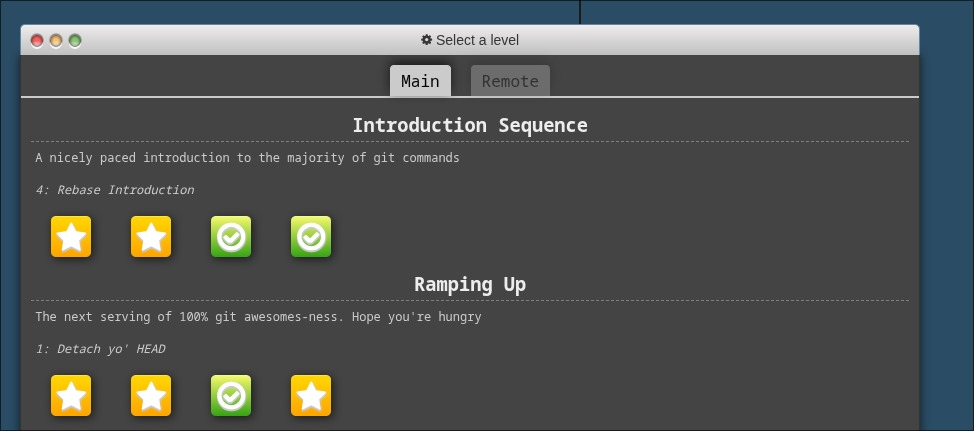
* **Remote:**
  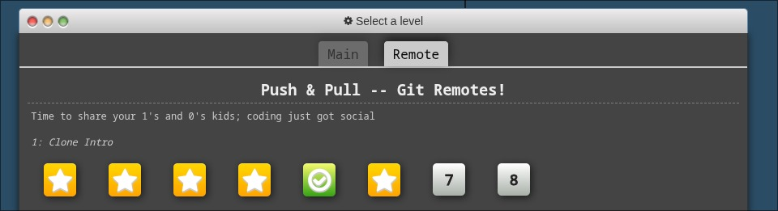

---

### **d. Pelajari bagaimana Git dan GitHub berkomunikasi dengan SSH (Secure Shell)**

Aku sudah belajar tentang mekanisme komunikasi Git dan GitHub menggunakan **SSH (Secure Shell)**, di mana autentikasi dilakukan menggunakan pasangan **public key** dan **private key** tanpa perlu memasukkan username dan password setiap kali melakukan operasi Git.

Selain itu, aku juga sudah mengerjakan exercise **"Git SSH Security"** pada W3Schools sebagai bukti pemahaman terkait penggunaan SSH dalam Git.

Screenshot bukti penyelesaian exercise:


---

### **e. Branching dan Pull Request**

Di sini aku menggunakan branching pada Git dengan:

* Membuat branch **`jawaban-a`** untuk mengerjakan Bagian A
* Membuat branch **`jawaban-b`** untuk mengerjakan Bagian B

Setelah pengerjaan selesai, kedua branch tersebut digabungkan ke branch **`main`** menggunakan **Pull Request** di GitHub.

Screenshot history branch dan proses merge:
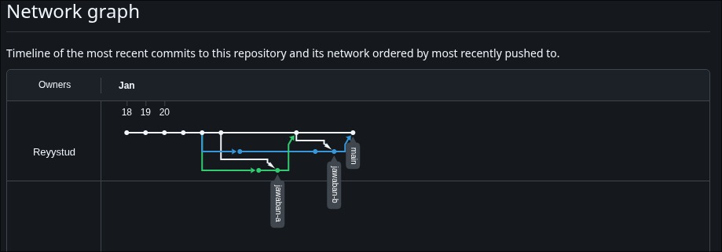

---

## **Jawaban untuk nomer A3**

### **a. Install QGroundControl di Linux**

Saya menggunakan **QGroundControl** sebagai ground control station untuk UAV.

Screenshot halaman utama QGroundControl:
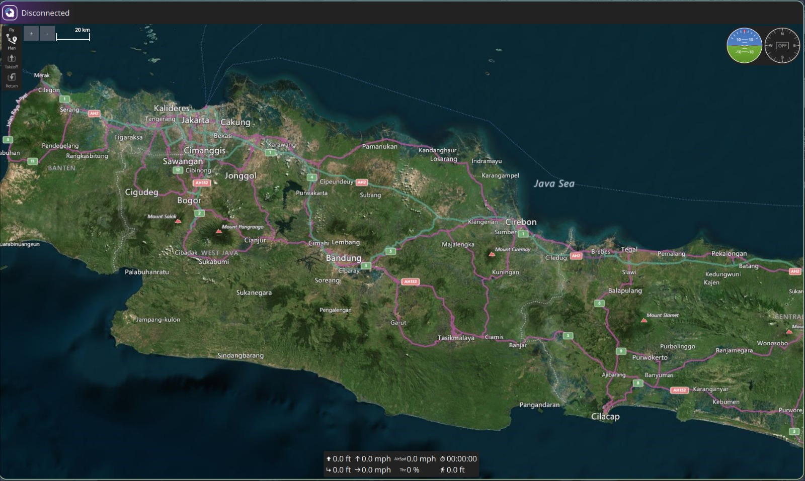

---

### **b. Fitur-fitur utama QGroundControl**

1. **Flight Planning**
   Digunakan untuk merancang misi penerbangan UAV dengan menentukan waypoint, ketinggian, dan pola penerbangan sebelum misi dijalankan.

2. **Real-Time Telemetry Monitoring**
   Menampilkan data penerbangan secara langsung seperti posisi GPS, ketinggian, kecepatan, orientasi UAV, serta status baterai.

3. **Vehicle Setup & Parameter Configuration**
   Memungkinkan pengguna untuk mengonfigurasi parameter UAV, termasuk sensor, kontroler, dan kalibrasi sebelum penerbangan.

4. **Map & Mission Visualization**
   Menampilkan peta lokasi UAV dan jalur misi secara visual sehingga operator dapat memantau pergerakan UAV dengan mudah.

---

### **c. Misi pemetaan sederhana 100 x 80**

Aku membuat pemetaan sederhana berbentuk area persegi panjang dengan panjang sekitar **100 meter** dan lebar sekitar **80 meter** menggunakan fitur **survey** pada QGroundControl. Misi ini dirancang untuk mensimulasikan pemetaan area menggunakan UAV dengan jalur waypoint otomatis.

Screenshot hasil perancangan misi:
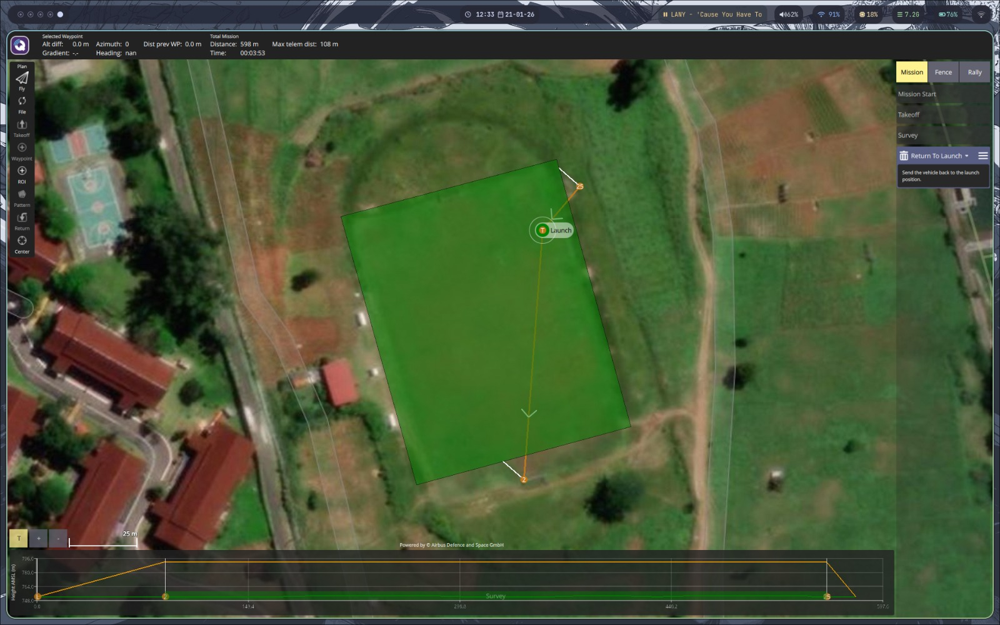

Atau file export dapat dilihat di:

```
../lampiran/mapping_100x80.plan
```

---

## **Jawaban untuk nomer A4**

### **a. Install Ubuntu**

Karena saat ini aku sudah menggunakan **Arch Linux**, aku memakai **Distrobox** di sistem host Arch Linux untuk menjalankan **Ubuntu 22.04 LTS**. Di dalam environment Ubuntu tersebut, aku menginstal paket-paket pendukung pengembangan menggunakan `apt` serta menginstal **ROS2 Humble**.

Screenshot environment:

* Arch Linux (host):
  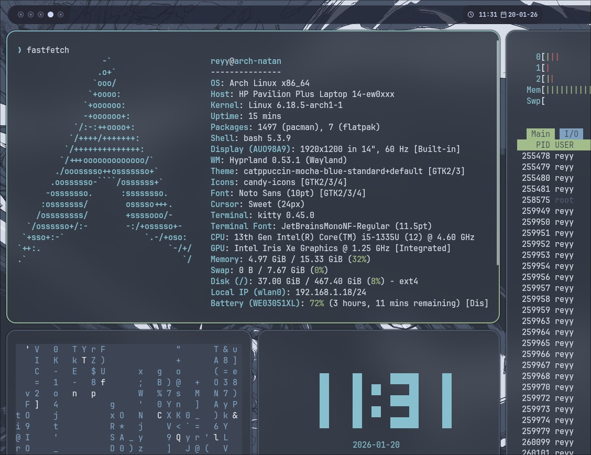
* Ubuntu 22.04 (Distrobox):
  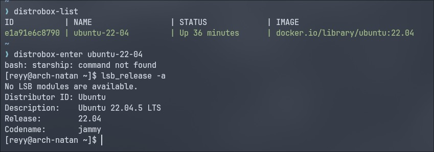

Untuk screenshot instalasi Python dan paket lain lupa diambil, jadi aku menggunakan bagian instalasi ROS sebagai dokumentasi:
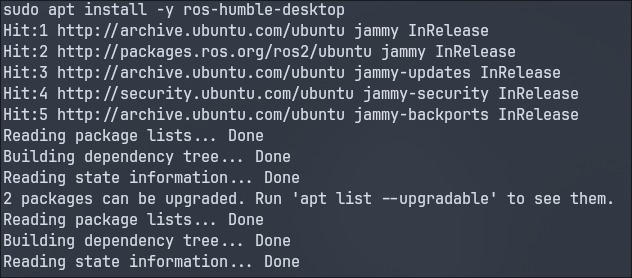

---

### **b. Menjalankan sistem talker–listener sederhana**

Setelah instalasi berhasil, aku menjalankan sistem **talker–listener** bawaan **ROS2 Humble** menggunakan dua terminal terpisah, di mana node **talker** mengirimkan pesan dan node **listener** menerima pesan tersebut secara real-time.

Screenshot hasil running:
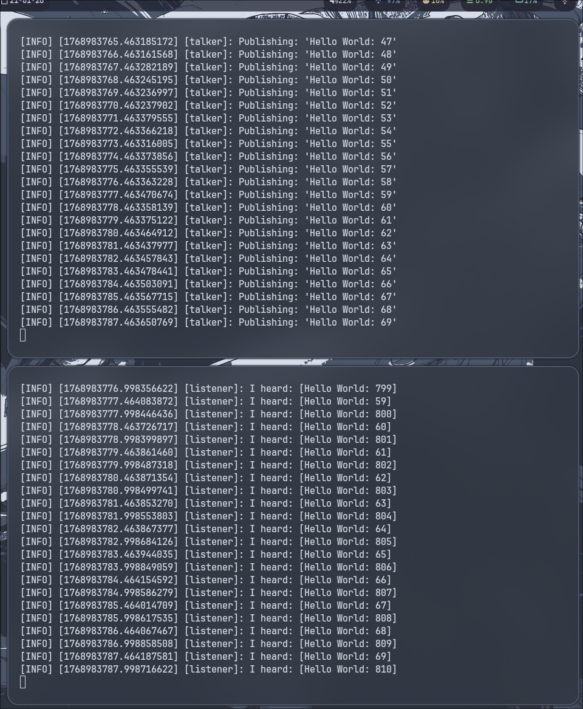

---

## **Jawaban untuk nomer A5**

### **a. Klasifikasi UAV berdasarkan cara terbangnya**

#### **1. VTOL (Vertical Take-Off and Landing / Rotary Wing)**

Drone VTOL adalah drone yang mampu lepas landas dan mendarat secara vertikal seperti helikopter. Jenis ini sangat cocok digunakan di area terbatas dan tidak memerlukan runway.

**Contoh:** Quadcopter, Helicopter, Tilt-rotor UAV (mirip mini Osprey)

**Mekanisme terbang:**

* Gaya angkat dihasilkan langsung dari putaran baling-baling
* Gerak dikontrol dengan perbedaan kecepatan rotasi antar motor

**Kelebihan:**

* Tidak membutuhkan runway
* Stabil untuk hovering
* Cocok untuk inspeksi dan pemetaan area sempit

**Kekurangan:**

* Efisiensi energi rendah
* Waktu terbang relatif singkat

*Sumber:* [https://www.drone.instiperjogja.ac.id/blog-details-46.html](https://www.drone.instiperjogja.ac.id/blog-details-46.html)

---

#### **2. HTOL (Horizontal Take-Off and Landing / Fixed Wing)**

HTOL merupakan UAV yang melakukan take-off dan landing secara horizontal dan membutuhkan landasan atau alat pelontar.

**Contoh:** Fixed Wing UAV, UAV dengan launcher catapult

**Mekanisme terbang:**

* Gaya angkat berasal dari airfoil (sayap)
* Membutuhkan kecepatan minimum (airspeed)

**Kelebihan:**

* Sangat efisien secara energi
* Jangkauan dan endurance panjang
* Cocok untuk pemetaan area luas

**Kekurangan:**

* Membutuhkan runway
* Tidak dapat hovering

*Sumber:* [https://training.terra-drone.co.id/drone-vtol-vs-drone-htol/](https://training.terra-drone.co.id/drone-vtol-vs-drone-htol/)

---

#### **3. Hybrid UAV**

Hybrid UAV menggabungkan mekanisme VTOL dan HTOL.

**Mekanisme terbang:**

* Take-off & landing vertikal
* Cruise horizontal menggunakan sayap

**Kelebihan:**

* Fleksibel
* Efisiensi lebih baik dibanding rotary-wing murni

**Kekurangan:**

* Sistem kompleks
* Bobot dan kontrol lebih sulit

---

### **b. Roll, Pitch, Yaw, Airspeed, Ground Speed, HDOP, dan RSSI**

**Roll, Pitch, dan Yaw**

* *Roll:* rotasi terhadap sumbu longitudinal
* *Pitch:* rotasi terhadap sumbu lateral
* *Yaw:* rotasi terhadap sumbu vertikal

Ketiganya membentuk **attitude UAV**.

**Airspeed dan Ground Speed**

* *Airspeed:* kecepatan UAV relatif terhadap udara
* *Ground speed:* kecepatan UAV relatif terhadap permukaan bumi

Hubungan:

```
Ground Speed = Airspeed + Wind Speed (vektor)
```

**HDOP (Horizontal Dilution of Precision)**

* Mengukur kualitas geometri satelit GPS
* Semakin kecil HDOP, semakin akurat posisi horizontal

**RSSI (Received Signal Strength Indicator)**

* Mengukur kekuatan sinyal komunikasi UAV–GCS
* RSSI rendah berisiko kehilangan link

---

### **c. Komponen UAV untuk pemetaan**

1. Frame
2. Motor & Propeller
3. ESC
4. Flight Controller (Autopilot)
5. Sensor
6. IMU
7. GPS
8. Barometer
9. Power System
10. Baterai Li-Po
11. Power Distribution Board
12. Payload
13. Kamera pemetaan
14. Communication System
15. Telemetry radio
16. RC receiver
17. Ground Control Station (GCS)

Diagram integrasi komponen:
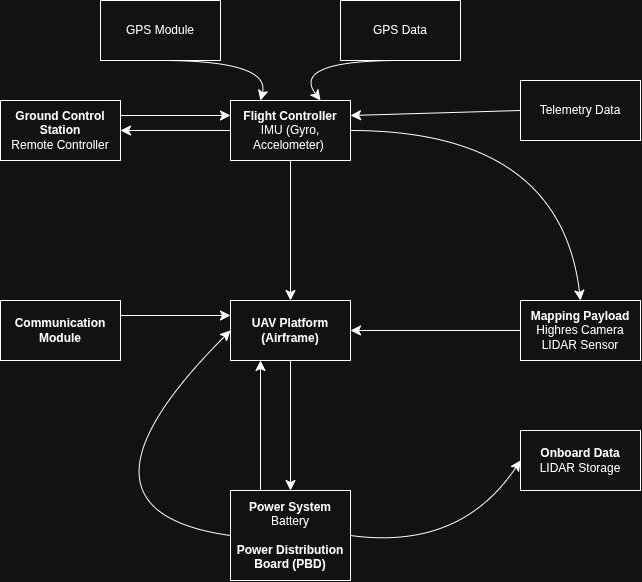

---

### **d. Insight artikel yang dibaca**

**Multirotor UAV—A Multidisciplinary Platform for Teaching Mechatronics Engineering**

Artikel ini membahas UAV sebagai platform pembelajaran multidisiplin dengan ekosistem **PX4** dan **MATLAB/Simulink**, yang menjembatani teori matematika dan aplikasi nyata.

Poin penting:

* UAV sebagai sistem mekatronika terintegrasi
* Simulasi penting sebelum implementasi hardware
* Pemanfaatan 3D printing untuk efisiensi biaya
* Open-source autopilot meningkatkan kesiapan industri

Artikel lengkap:
[https://www.mdpi.com/1424-8220/25/4/1007](https://www.mdpi.com/1424-8220/25/4/1007)

---

## **Jawaban untuk nomer A6**

### **a. Algoritma A* dan D***

Algoritma **A*** merupakan pengembangan dari BFS dan memilih jalur dengan biaya minimum menggunakan fungsi:

```
f(v) = g(s → v) + h(v → r)
```

Keterangan:

* `g(s → v)` : biaya dari start ke node v
* `h(v → r)` : estimasi biaya ke goal
* `f(v)` : total biaya

Diagram pencarian A*:
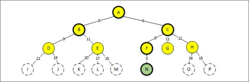

**D*** adalah pengembangan A* untuk lingkungan dinamis dan melakukan replanning secara inkremental.

Perbedaan utama:

* A*: peta statis
* D*: peta dinamis

---

### **b. Proportional–Integral–Derivative (PID)**

PID adalah algoritma kontrol umpan balik untuk menjaga sistem pada setpoint.

Komponen:

1. **P:** respon terhadap error saat ini
2. **I:** menghilangkan steady-state error
3. **D:** meredam osilasi

Diagram dan rumus:
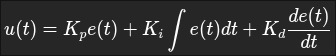


---

### **c. Kalman Filter dan Extended Kalman Filter (EKF)**

Kalman Filter digunakan untuk estimasi state sistem linear dengan noise Gaussian melalui tahap **prediction** dan **update**.

Untuk UAV yang non-linear digunakan **EKF** dengan linearisasi Jacobian.

Digunakan pada:

* Estimasi attitude
* Sensor fusion IMU, GPS, barometer
* Autopilot PX4 dan ArduPilot

---

## **Referensi**

### **A* & D***

1. Hart et al. (1968)
2. Koenig & Likhachev (2002)
3. [https://www.jsi.stikom-bali.ac.id/index.php/jsi/article/download/335/209](https://www.jsi.stikom-bali.ac.id/index.php/jsi/article/download/335/209)

### **PID**

1. Åström & Hägglund (2006)
2. ArduPilot Documentation
3. NI PID Theory
4. ChatGPT

### **Kalman Filter & EKF**

1. Kalman (1960)
2. Mahony et al. (2012)
3. PX4 Autopilot Documentation
